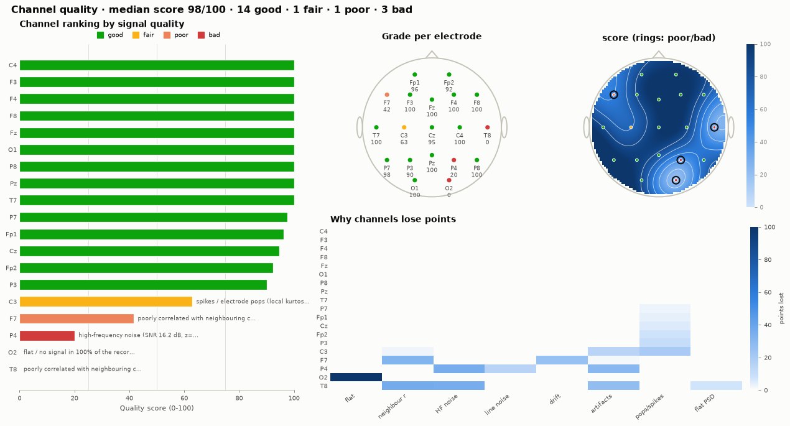
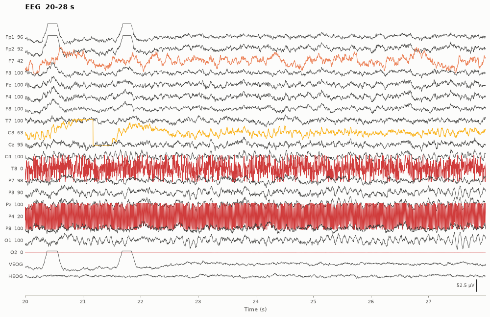
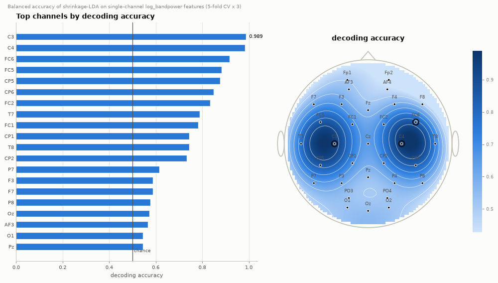
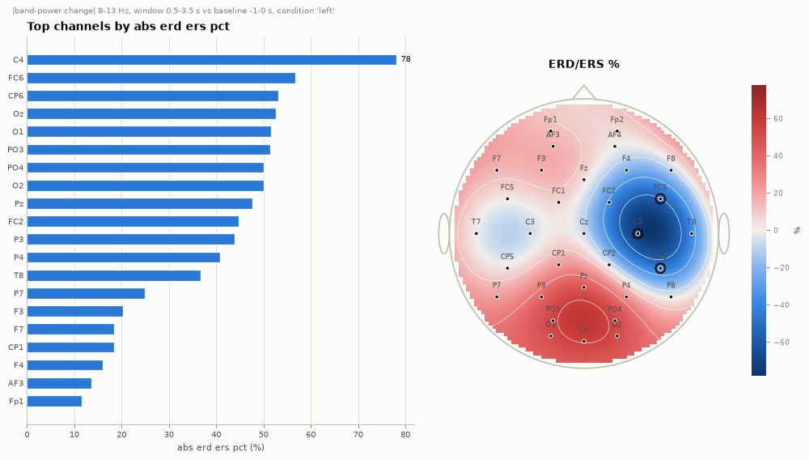
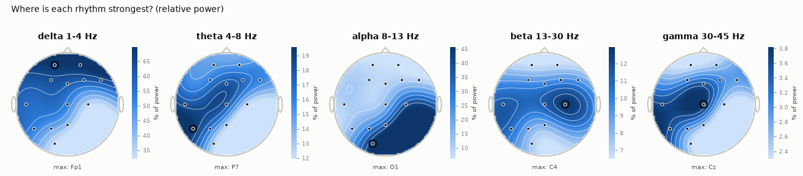

# EEG Analysis (`eegproc`)

A Python toolkit that reads EEG recordings in **any common file format**, gives
you clean access to every **channel**, runs a complete **processing pipeline**,
and answers the practical question **"which channels are performing well?"**
with scores, rankings, scalp maps and a one-file HTML report.

Everything core is written from scratch on top of `numpy`, `scipy` and
`matplotlib`: the EDF/BDF, BrainVision, text, MATLAB/EEGLAB and NumPy
readers/writers, the filters, re-referencing, spherical-spline
interpolation, PREP-style bad-channel detection, FastICA, spectral and
connectivity analysis, channel-quality scoring, decoding and plots. Rarer
formats (FIF, GDF, CNT, MFF, ...) are read through MNE-Python if it is
installed.



---

## Contents

- [Install](#install)
- [Quick start (Python)](#quick-start-python)
- [Quick start (command line)](#quick-start-command-line)
- [Supported file formats](#supported-file-formats)
- [Which channel is performing?](#which-channel-is-performing)
- [Processing toolbox](#processing-toolbox)
- [Project layout](#project-layout)
- [Documentation](#documentation)
- [Testing](#testing)

## Install

**Google Colab (nothing to install on your computer).** Open the ready-made notebook:

[](https://colab.research.google.com/github/rsd21/eeg-analysis/blob/main/notebooks/eeg_analysis_colab.ipynb)

or put this in the first cell of any Colab notebook:

```python
!pip install -q git+https://github.com/rsd21/eeg-analysis.git
```

**Your own computer** (Python 3.9 or newer):

```bash
git clone https://github.com/rsd21/eeg-analysis.git
cd eeg-analysis
pip install -e .              # core: numpy, scipy, matplotlib
pip install -e ".[all]"       # optional: h5py, pyxdf, mne, pyyaml, pandas
```

On Windows, install Python from [python.org](https://www.python.org/downloads/)
with "Add python.exe to PATH" ticked, and use `python -m pip install -e .` if
`pip` is not recognised.

## Quick start (Python)

```python
import eegproc as ep

raw = ep.read_raw("recording.edf")        # .edf .bdf .vhdr .csv .txt .mat .set .npz .h5 .xdf .fif ...
raw.set_montage("standard_1010")          # electrode positions for 10-20 / 10-10 names
print(raw.describe())                     # channels, types, units, rate, duration, events

# --- access
cz = raw["Cz"]                                        # one channel (µV)
block = raw.get_data(picks="eeg", tmin=10, tmax=20)   # EEG channels, 10-20 s
events, event_id = raw.find_events()                  # from annotations or trigger channel

# --- which channels perform well?
quality = raw.assess_quality()            # 0-100 score, grade and reasons per channel
print(quality.summary())
quality.plot()                            # dashboard figure (above)

# --- clean
clean = (raw.filter(1.0, 40.0)            # zero-phase band-pass
            .notch_filter("auto")         # finds 50 or 60 Hz
            .set_bads(quality.bad_channels)
            .interpolate_bads()           # spherical splines
            .set_reference("average"))
clean, ica = ep.remove_artifacts_ica(clean)   # FastICA, removes eye-blink components

clean.save("clean.edf")                   # or .bdf .vhdr .csv .npz .mat .h5 .fif
ep.generate_report(clean, "report.html")  # everything in one HTML file
```

No data at hand? `ep.simulate_eeg(...)` produces realistic recordings with
known ground truth (1/f background, alpha, blinks, line noise, ERPs or
motor-imagery ERD, and injected bad channels).

## Quick start (command line)

```bash
eegproc formats                                   # list readable/writable formats
eegproc simulate demo.edf --task oddball --bad-channels   # make a test file

eegproc info demo.edf                             # channels, types, rate, events
eegproc quality demo.edf --csv quality.csv --plot quality.png
eegproc rank demo.edf --by alpha                  # where is alpha strongest?
eegproc rank demo.edf --by erp --conditions target --reject 150
eegproc rank demo.edf --by decoding --feature erp --window 0.1,0.6
eegproc convert demo.edf demo.vhdr                # any format -> any writable format
eegproc process demo.edf --config examples/pipeline.yaml -o clean.edf
eegproc report demo.edf -o report.html
eegproc plot demo.edf --kind bands -o bands.png   # raw | psd | sensors | bands | spectrogram | quality ...
eegproc features demo.edf -o features.csv
```

`python -m eegproc ...` works as well.

## Supported file formats

| Format | Extensions | Read | Write | Notes |
|---|---|---|---|---|
| European Data Format | `.edf` `.rec` | native | yes | EDF and EDF+ (annotations, discontinuous flag), mixed sampling rates, partial reads |
| BioSemi | `.bdf` | native | yes | 24-bit, BDF+ annotations, Status trigger channel |
| BrainVision | `.vhdr` `.vmrk` `.eeg` | native | yes | int16/int32/float32, multiplexed/vectorized, ASCII data, markers |
| Text | `.csv` `.tsv` `.txt` `.dat` `.asc` | native | yes | auto delimiter/header/time column, `Sample Rate = ...` comments (OpenBCI), marker columns, channels in rows or columns |
| NumPy | `.npy` `.npz` | native | yes (`.npz`) | `.npz` stores names, types, units, positions, bads, annotations |
| MATLAB | `.mat` | native | yes | v4-v7.2 via scipy, v7.3 via h5py; searches for data / sampling rate / labels |
| EEGLAB | `.set` (+ `.fdt`) | native | – | channel locations and events (export with `raw.to_mne()` + MNE) |
| HDF5 | `.h5` `.hdf5` | h5py | yes | |
| Lab Streaming Layer | `.xdf` | pyxdf | – | EEG stream + marker streams as annotations |
| MNE / Neuromag | `.fif` | MNE | yes (MNE) | |
| GDF, Neuroscan CNT, EGI MFF, Curry, Persyst, Nicolet, Nihon Kohden, ... | | MNE | – | through `read_with_mne` |

Unknown extensions are recognised from the file content where possible.
Voltage channels are always stored in **microvolts**, channel labels are
normalised (`"EEG FP1-REF"` → `Fp1`, `T3` → `T7`; originals kept in
`raw.meta["original_ch_names"]`) and channel types are inferred (EEG, EOG,
ECG, EMG, stim, respiration, misc). See [docs/file_formats.md](docs/file_formats.md).

## Which channel is performing?

"Performing" means different things depending on the question, so
`eegproc` answers several of them. All rankings return a `ChannelRanking`
that prints as a table, saves to CSV and plots as a bar chart plus a scalp
map.

| Question | Call | Needs |
|---|---|---|
| Is the electrode recording clean signal? | `raw.assess_quality()` / `rank_channels(raw, "quality")` | raw data |
| Which channels have the best signal-to-noise ratio? | `rank_channels(raw, "snr")` | raw data |
| Where is each rhythm (delta … gamma) strongest? | `rank_channels(raw, "alpha")`, `band_activity(raw)` | raw data |
| Which channels are network hubs? | `rank_channels(raw, "connectivity")` | raw data |
| Which channel shows the clearest evoked response (ERP)? | `erp_snr(epochs)` | events |
| Which channel desynchronises most during a task (ERD/ERS)? | `erd_ers(epochs)` | events |
| Which channel separates two conditions best? | `discriminability(epochs)` | ≥ 2 conditions |
| Which single channel decodes the condition best? | `decoding_accuracy(epochs)` | ≥ 2 conditions |

### Channel quality score

Every channel starts at 100 points and loses points for each problem, with
a plain-English reason:

| Problem | How it is measured |
|---|---|
| flat / disconnected | windows with < 0.5 µV standard deviation |
| clipping | samples stuck at the amplifier's limits |
| abnormal amplitude | robust z-score of the channel's amplitude vs. the others |
| poor contact | low correlation with its spatial neighbours |
| high-frequency noise | PREP noisiness z-score and SNR (1-30 Hz vs. > 45 Hz) |
| line noise | 50/60 Hz peak height |
| drift | < 1 Hz fluctuations vs. the 1-40 Hz signal and vs. the other channels |
| pops / spikes | kurtosis of the channel minus its neighbours (blinks cancel, pops do not) |
| local artifacts, unstable contact, noise-like spectrum | windowed outliers, amplitude variability, 1/f exponent |

Grades: **good** ≥ 75 > **fair** ≥ 50 > **poor** ≥ 25 > **bad**. The PREP
pipeline criteria (deviation, correlation, noisiness, dropout, RANSAC) are
also run and reported. On simulated data with eight kinds of injected faults
the faulty channels are exactly the lowest-ranked ones. Full definitions are
in [docs/channel_quality.md](docs/channel_quality.md).



### Task performance

For a motor-imagery recording (imagined left vs. right hand movement), the
per-channel decoding ranking puts C3 and C4 on top, the classic
sensorimotor sites, and the ERD map shows desynchronisation over the motor
cortex opposite the imagined hand:




Where each rhythm lives:



## Processing toolbox

| Area | What is available |
|---|---|
| Data model | `RawEEG` (continuous), `Epochs`, `Evoked`, `Annotations`, `Montage`; picks by name, type, index or `'good'`; crop, pick, drop, rename, append, add channels |
| Montages | built-in 10-20 / 10-10 positions (no data files needed), custom `.elc` `.sfp` `.loc` `.ced` `.csv`/`.tsv` layouts, sphere fitting |
| Filtering | Butterworth IIR (zero-phase) or windowed-sinc FIR, high/low/band-pass, band-stop, notch with harmonics, automatic 50/60 Hz detection |
| Re-referencing | average, median, channel(s), linked mastoids, bipolar (double banana, transverse), Hjorth and spherical-spline (CSD) Laplacian |
| Resampling | polyphase anti-aliased resampling that keeps trigger codes |
| Bad channels | PREP criteria incl. RANSAC; spherical-spline interpolation |
| Artifacts | amplitude/flat segments, muscle bursts, blink detection, FastICA with eye/heart/muscle component labelling |
| Spectra | Welch, multitaper (DPSS), periodogram, band power (absolute/relative), peak alpha frequency, spectral edge/entropy, 1/f exponent, spectrogram, Morlet wavelets |
| Features | Hjorth parameters, line length, zero crossings, skewness/kurtosis, sample & permutation entropy, Higuchi/Katz fractal dimension, band ratios |
| Connectivity | correlation, coherence, imaginary coherence, PLV, PLI, wPLI, amplitude-envelope correlation, node strength |
| Events | trigger-channel and annotation events, epoching with baseline, rejection and bad-segment skipping, ERPs, GFP |
| Decoding | shrinkage (Ledoit-Wolf) LDA, stratified cross-validation, binomial test vs. chance |
| Output | matplotlib figures, CSV/JSON tables, self-contained HTML report, JSON/YAML pipelines |

## Project layout

```
eegproc/
  core/           RawEEG, Epochs/Evoked, Annotations, channel names & types, montages
  io/             readers/writers: edf, brainvision, text, arrays (npy/mat/set/h5), xdf, mne bridge
  preprocessing/  filters, reference, resample, bad_channels, interpolation, artifacts, ica
  analysis/       spectral, features, connectivity
  quality/        metrics, channel_quality (0-100 score), ranking (performance rankings, LDA)
  viz/            traces, spectra, topomaps, quality dashboards, ERP/ERD, connectivity
  report/         HTML report
  datasets/       realistic EEG simulator with ground truth
  pipeline.py     JSON/YAML pipelines
  cli.py          `eegproc` command
examples/         runnable scripts (quick start, preprocessing, channel performance, ERP, BCI, formats, eye blinks)
notebooks/        Google Colab notebook
tests/            pytest suite, including cross-checks against MNE's readers and writers
docs/             guides
```

## Documentation

- [docs/processing_guide.md](docs/processing_guide.md): recommended pipelines for resting-state, ERP and BCI data, with the reasoning behind each step
- [docs/channel_quality.md](docs/channel_quality.md): every quality metric, its threshold and how to read the report
- [docs/file_formats.md](docs/file_formats.md): format details, units, channel naming, partial reads
- [examples/](examples): scripts that run end-to-end on simulated data or your own file
- [notebooks/eeg_analysis_colab.ipynb](notebooks/eeg_analysis_colab.ipynb): load, score channels, detect and remove eye blinks, and download a report, all in Colab

## Testing

```bash
pip install -e ".[dev]"
pytest
```

The suite checks, among other things, that EDF/BDF/BrainVision/EEGLAB
files written by MNE, edfio and pybv are read correctly (and vice versa),
that filters meet their specifications, that ICA recovers mixed sources,
that interpolation reproduces smooth fields, and that the quality score and
rankings find the ground truth planted in simulated recordings.
